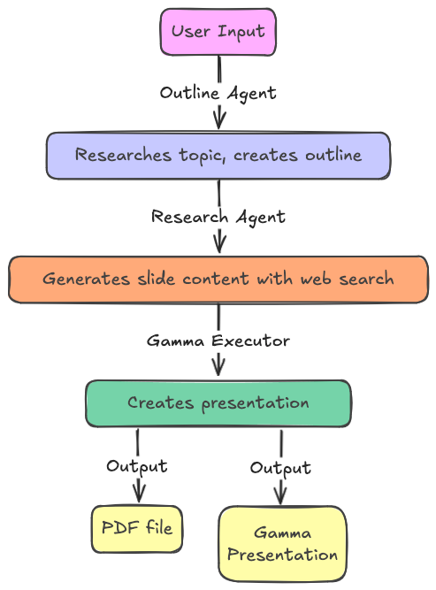

# Sample code for Microsoft Agent Framework

Includes workflow to build a presentation with the Gamma API based on outline and research agents. See blog post: https://baeke.info/2025/10/19/creating-presentations-with-microsoft-agent-framework-and-gamma-api/

